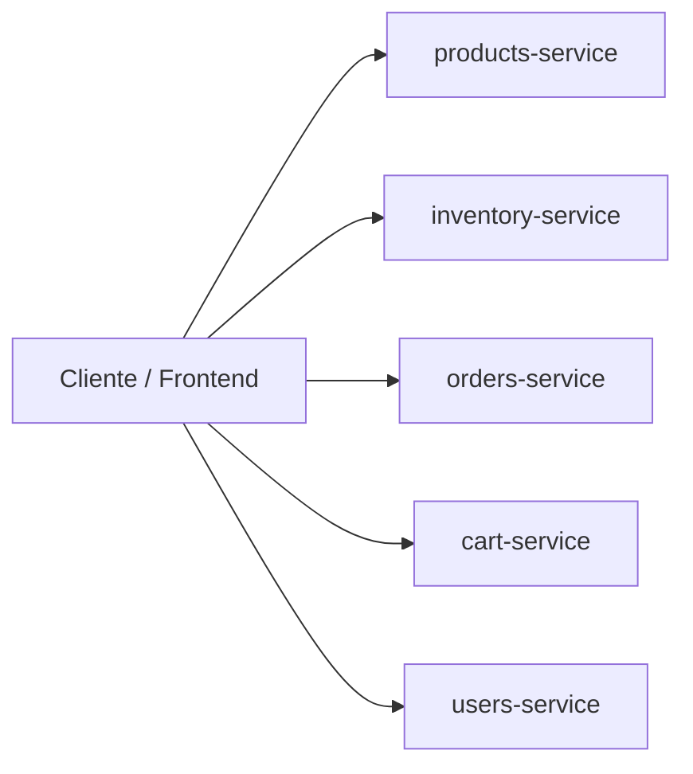

# Informe de Microservicio - orders-service

## 1. Integrantes del grupo

Indicar los nombres de los estudiantes que participaron en el trabajo.

- Fabián Lecaros Ampuero

---

## 2. Análisis del problema

El problema presentado en el caso corresponde a un sistema monolítico, donde múltiples funcionalidades del negocio se encuentran acopladas en una sola aplicación. Esto provoca que cualquier cambio, corrección o nueva funcionalidad afecte al sistema completo, dificultando su mantenimiento, escalabilidad y despliegue.

El sistema monolítico presenta dificultades porque concentra en una sola base de código procesos distintos, como gestión de productos, inventario, usuarios, carrito de compras y órdenes. Como consecuencia, el crecimiento del sistema vuelve más compleja su administración, aumenta el riesgo de errores en cascada y limita la posibilidad de escalar solamente los módulos que más lo necesitan.

El problema específico que busca resolver el microservicio diseñado es la gestión de las órdenes de compra. Para ello, se separa esta responsabilidad en un servicio independiente, capaz de crear, listar y consultar órdenes sin depender directamente de la lógica interna de otros módulos del sistema.

---

## 3. Arquitectura elegida

**Arquitectura elegida: Microservicios**

Esta arquitectura es adecuada para resolver el problema porque permite dividir el sistema en servicios pequeños, independientes y especializados en una única responsabilidad de negocio. De esta forma, cada microservicio puede desarrollarse, mantenerse, desplegarse y escalarse de manera separada.

En este caso, la arquitectura de microservicios facilita que el servicio de órdenes funcione de forma desacoplada respecto de otros servicios como productos, inventario, carrito y usuarios. Esto mejora la mantenibilidad del sistema, reduce el impacto de cambios en otros módulos y favorece una evolución más ordenada de la solución.

### Diagrama de arquitectura

---

## 4. Diseño del microservicio

### Microservicio diseñado: `orders-service`

**Responsabilidad:**  
Gestionar las órdenes de compra registradas en el sistema.

**Información o datos que maneja:**  
El microservicio maneja la información general de una orden y el detalle de sus productos asociados.

### Estructura principal de datos

**Entidad `Orden`:**
- `id`: identificador de la orden
- `customerName`: nombre del cliente
- `status`: estado de la orden
- `total`: total monetario de la orden
- `items`: listado de productos asociados a la orden

**Entidad `OrdenItem`:**
- `id`: identificador del ítem
- `productId`: identificador del producto
- `quantity`: cantidad solicitada
- `price`: precio del producto en la orden

### Listado general de microservicios del sistema

- `products-service`
- `inventory-service`
- `orders-service`
- `cart-service`
- `users-service`

---

## 5. Endpoints implementados

### `GET /api/v1/ordenes`
Devuelve la lista completa de órdenes registradas en el sistema.

### `GET /api/v1/ordenes/{id}`
Devuelve una orden específica según su identificador.

### `POST /api/v1/ordenes`
Permite crear una nueva orden a partir de los datos enviados en el cuerpo de la solicitud.

---

## 6. Enlaces del proyecto

### Repositorio del proyecto
Repositorio en GitHub:  
<https://github.com/flecaros84/orders_service>

### URL del microservicio desplegado en Render
URL base desplegada:  
<https://orders-service-4.onrender.com/api/v1/ordenes/>

---

## Observación

Los nombres de los integrantes deben ser reemplazados por los reales antes de la entrega final.
